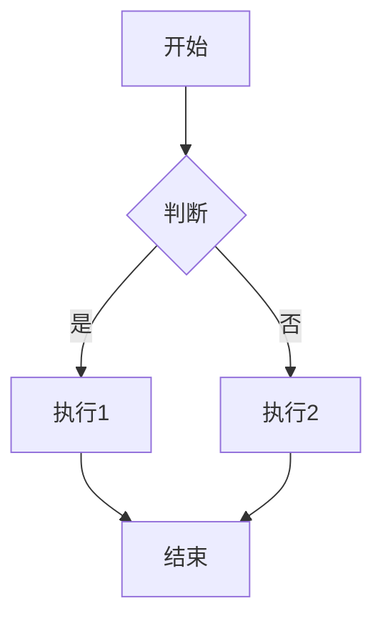
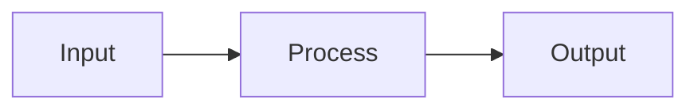
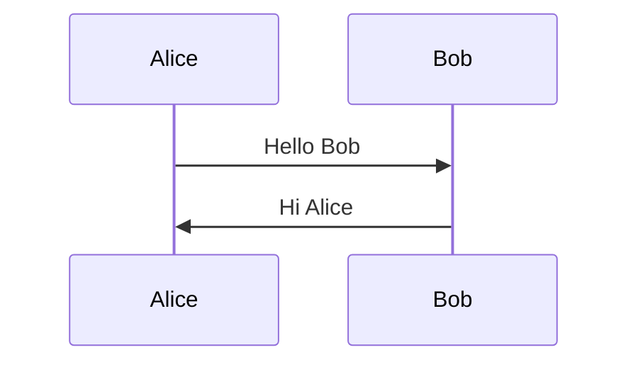

# 自定义标签示例

Almagest 主题提供了一系列自定义标签，用于在文章中插入特殊内容。

## 1. 提示框 (note)

在文章中添加醒目的提示框：

```html
 默认提示框   主要提示框   成功提示框   警告提示框  
危险提示框   信息提示框   浅色提示框 
```

**效果：**

- default: 灰色边框
- primary: 蓝色边框
- success: 绿色边框
- warning: 黄色边框
- danger: 红色边框
- info: 浅蓝色边框
- light: 浅灰色边框

## 2. 时间线 (timeline)

创建时间线展示：

```html

<!-- 按时间顺序排列 -->
 第一件大事的描述  
第二件大事的描述   第三件大事的描述  
```

## 3. 折叠块 (folding)

可折叠的内容区域：

```html
 这里是折叠的内容 可以放很多文字 包括代码块、图片等   自定义折叠标题 
```

## 4. 链接卡片 (link)

显示链接预览卡片：

```html

```

## 5. 选项卡 (tabs)

创建选项卡切换：

```html

<!-- tab -->
第一个标签页的内容
<!-- endtab -->
<!-- tab -->
第二个标签页的内容
<!-- endtab -->
<!-- tab -->
第三个标签页的内容
<!-- endtab -->

```

### 带标题的选项卡

```html

<!-- tab -->
第二个标签页会默认选中
<!-- endtab -->
... 
```

## 6. 标签徽章 (label)

显示彩色标签：

```html
     
```

## 7. 视频 (video)

嵌入视频：

```html

```

### 多个视频

```html
  

```

## 8. 音频 (audio)

嵌入音频：

```html

```

## 9. 图片画廊 (gallery)

创建图片画廊：

```html
  
 
```

## 10. 代码块增强

### 带标题的代码块

````markdown
```javascript title="example.js"
const hello = 'world';
console.log(hello);
```
````

### 带行号

````markdown
```javascript linenums
const x = 1;
const y = 2;
```
````

### 高亮特定行

````markdown
```javascript
// [!code highlight]
const x = 1; // 这行会高亮
const y = 2;
```
````

### 折叠代码块

超过 30 行的代码块会自动显示折叠按钮。

## 11. 脚注

在文章中添加脚注：

```markdown
这是一个有脚注的句子[^1]。

[^1]: 这是脚注的内容。
```

## 12. 表格

```markdown
| 表头1   | 表头2   | 表头3   |
| ------- | ------- | ------- |
| 单元格1 | 单元格2 | 单元格3 |
| 单元格4 | 单元格5 | 单元格6 |
```

## 13. 数学公式

### 行内公式

```markdown
这是行内公式 $E = mc^2$
```

### 块级公式

```markdown
$$
\int_{-\infty}^{\infty} e^{-x^2} dx = \sqrt{\pi}
$$
```

## 14. Mermaid 图表

````markdown

````

### 流程图



### 时序图



### 饼图


## 完整示例

````markdown
---
title: 自定义标签示例
date: 2024-01-01
---

# 常用标签示例

## 提示框


这是一个成功提示！


## 时间线








## 代码块

```javascript title="hello.js"
// [!code highlight]
const greeting = 'Hello, World!';
console.log(greeting);
```
````

## 数学公式

$$f(x) = \sum_{i=0}^{n} \frac{a_i}{1+x}$$

```

```
